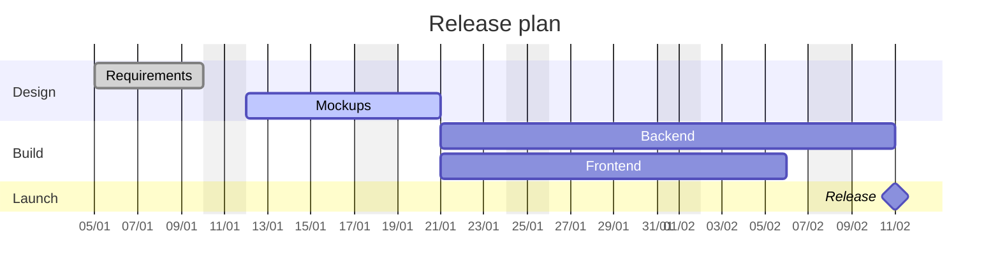

# gantt

```mermaid
gantt
    title Release plan
    dateFormat YYYY-MM-DD
    axisFormat %d/%m
    excludes weekends

    section Design
    Requirements      :done,    req, 2026-01-05, 5d
    Mockups           :active,  mock, after req, 7d
    section Build
    Backend           :         be, after mock, 15d
    Frontend          :         fe, after mock, 12d
    section Launch
    Release           :milestone, rel, after be fe, 0d
```

Task syntax: `Name :[tags,] [id,] start, duration|end`. Tags: `done`, `active`, `crit`,
`milestone`. Start can be a date or `after id1 id2`.
